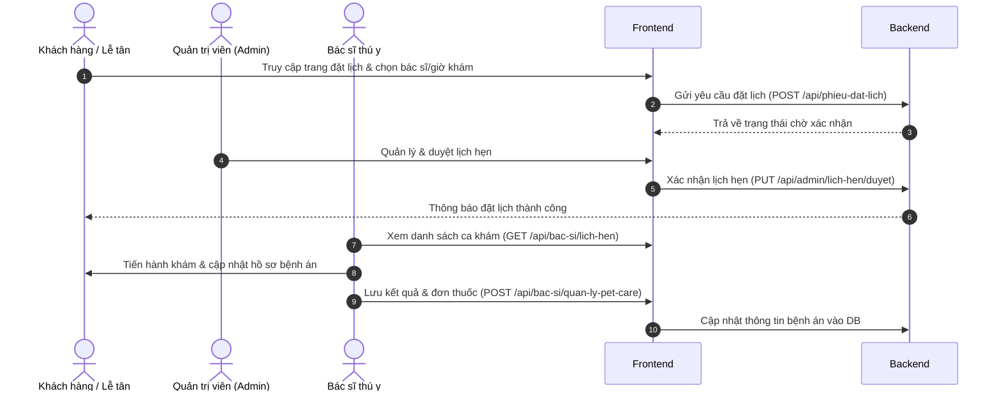

# 🐾 Hệ Thống Quản Lý Phòng Khám Thú Y — PetCare

[](https://sonarcloud.io/summary/new_code?id=trananhtai2204205-beep_PetCare)
[](https://sonarcloud.io/summary/new_code?id=trananhtai2204205-beep_PetCare)
[](https://sonarcloud.io/summary/new_code?id=trananhtai2204205-beep_PetCare)
[](https://sonarcloud.io/summary/new_code?id=trananhtai2204205-beep_PetCare)
[](https://sonarcloud.io/summary/new_code?id=trananhtai2204205-beep_PetCare)

Dự án PetCare là hệ thống quản lý phòng khám thú y được xây dựng với kiến trúc tách biệt hoàn toàn giữa **Frontend (Vue 3)** và **Backend (Laravel API)**.

---

## 📌 SƠ ĐỒ QUY TRÌNH HỆ THỐNG (Workflows)

Dưới đây là sơ đồ quy trình đặt khám và xử lý ca bệnh của hệ thống PetCare:



---

## 📖 TÀI LIỆU API (API Documentation)

Hệ thống API Backend sử dụng xác thực qua **Laravel Sanctum**. Mọi request gửi đi yêu cầu đính kèm Header: `Authorization: Bearer <TOKEN>`.

### 1. Phân hệ Lễ tân (Khách hàng)
* **Đăng nhập**: `POST /api/le-tan/login`
  * Body: `{ "email": "...", "password": "..." }`
* **Đăng ký tài khoản**: `POST /api/le-tan/register`
* **Đặt lịch khám**: `POST /api/le-tan/dat-lich`
* **Xem danh sách bác sĩ**: `GET /api/le-tan/danh-sach-bac-si`

### 2. Phân hệ Bác sĩ
* **Xem lịch hẹn phân công**: `GET /api/bac-si/lich-hen`
* **Xem lịch làm việc cá nhân**: `GET /api/bac-si/lich-ca-nhan`
* **Cập nhật hồ sơ bệnh án**: `POST /api/bac-si/quan-ly-pet-care/store`
  * Body: `{ "id_lich_hen": 1, "chuan_doan": "...", "don_thuoc": "..." }`

### 3. Phân hệ Admin
* **Xem Dashboard thống kê**: `GET /api/admin/dashboard`
* **Duyệt lịch hẹn**: `POST /api/admin/lich-hen/accept`
* **Quản lý danh sách bác sĩ**: `GET /api/admin/bac-si` | `POST /api/admin/bac-si/store`
* **Quản lý chuyên khoa**: `GET /api/admin/chuyen-khoa`

---

## 🗂️ Cấu Trúc Thư Mục Dự Án

```
📂 PetCare/                              ← Mã nguồn Frontend (Vue 3 + Vite)
📂 Be-PetCare--feature-develop/          ← Mã nguồn Backend (Laravel 12 + MySQL)
```

---

## ⚙️ Yêu Cầu Cài Đặt Hệ Thống

Trước khi bắt đầu, hãy đảm bảo máy tính của bạn đã cài đặt các công cụ sau:
* **Node.js**: Phiên bản `18.x` hoặc `>= 22.x`
* **PHP**: Phiên bản `>= 8.2` (Khuyên dùng PHP 8.4)
* **Composer**: Phiên bản `>= 2.x`
* **MySQL**: Phiên bản `>= 8.x`

---

## 🖥️ HƯỚNG DẪN CÀI ĐẶT BACKEND (Laravel)

Di chuyển vào thư mục backend và thực hiện các bước cấu hình:

### 1. Di chuyển vào thư mục Backend
```bash
cd Be-PetCare--feature-develop
```

### 2. Cài đặt các thư viện PHP
```bash
composer install
```

### 3. Tạo file cấu hình môi trường `.env`
```bash
cp .env.example .env
```

### 4. Tạo mã khóa ứng dụng (Application Key)
```bash
php artisan key:generate
```

### 5. Tạo Database và cấu hình kết nối
Tạo database mới có tên:
```sql
CREATE DATABASE PetCare CHARACTER SET utf8mb4 COLLATE utf8mb4_unicode_ci;
```

Cập nhật thông tin kết nối database trong file `.env`:
```env
DB_CONNECTION=mysql
DB_HOST=127.0.0.1
DB_PORT=3306
DB_DATABASE=PetCare
DB_USERNAME=root
DB_PASSWORD=
```

### 6. Khởi tạo bảng dữ liệu và nạp dữ liệu mẫu (Seed)
```bash
php artisan migrate --seed
```

### 7. Tạo liên kết thư mục chứa ảnh (Storage Link)
```bash
php artisan storage:link
```

### 8. Khởi chạy Server API Backend
```bash
php artisan serve
```
👉 Server Backend sẽ chạy tại địa chỉ: **[http://127.0.0.1:8000](http://127.0.0.1:8000)**

---

## 🌐 HƯỚNG DẪN CÀI ĐẶT FRONTEND (Vue 3 + Vite)

### 1. Di chuyển vào thư mục Frontend
```bash
cd PetCare
```

### 2. Cài đặt các gói thư viện Node.js
```bash
npm install
```

### 3. Cấu hình IP API kết nối tới Backend
Mở các file sau và trỏ API về địa chỉ local:
* **Admin API**: `src/core/baseRequestAdmin.js` -> `const apiUrl = "http://127.0.0.1:8000/api/";`
* **Bác sĩ API**: `src/core/baseRequestBacsi.js` -> `const apiUrl = "http://127.0.0.1:8000/api/";`
* **Lễ tân API**: `src/core/baseRequestLeTan.js` -> `const apiUrl = "http://127.0.0.1:8000/api/";`

### 4. Khởi chạy Server Frontend
```bash
npm run dev
```
👉 Truy cập giao diện ứng dụng tại địa chỉ: **[http://localhost:5173](http://localhost:5173)**

---

## 🔑 THÔNG TIN TÀI KHOẢN ĐĂNG NHẬP MẪU

Sau khi chạy lệnh `php artisan db:seed`, hệ thống sẽ tự động nạp các tài khoản thử nghiệm sau:

| Vai trò | Đường dẫn đăng nhập | Email mẫu | Mật khẩu mặc định |
| :--- | :--- | :--- | :--- |
| **Admin** | `http://localhost:5173/admin/login` | `admin@gmail.com` | `123456` |
| **Lễ tân** | `http://localhost:5173/login` | `letan@gmail.com` | `123456` |
| **Bác sĩ** | `http://localhost:5173/bac-si/login` | `bacsi@gmail.com` | `123456` |

---

## 🛠️ Khắc Phục Lỗi Thường Gặp (Troubleshooting)

### 1. Lỗi CORS khi gọi API
Mở file `config/cors.php` trong Laravel và cấu hình:
```php
'allowed_origins' => ['http://localhost:5173'],
```

### 2. Thiếu quyền thực thi lệnh npm (macOS)
```bash
chmod +x node_modules/.bin/*
```

---
*📅 Tài liệu được cập nhật ngày: 16/07/2026 bởi Antigravity*
