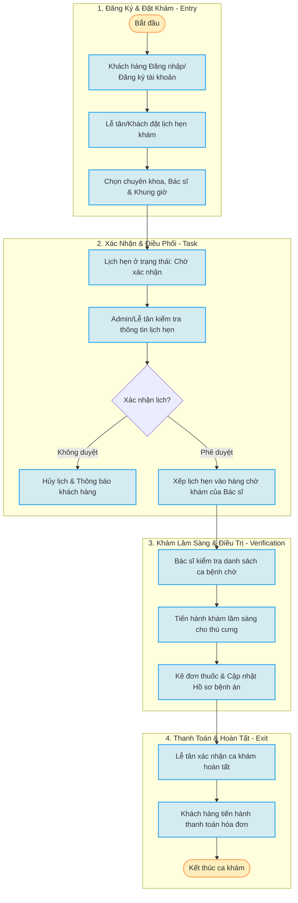

# 🐾 Hệ Thống Quản Lý Phòng Khám Thú Y — PetCare

[](https://sonarcloud.io/summary/new_code?id=trananhtai2204205-beep_PetCare)
[](https://sonarcloud.io/summary/new_code?id=trananhtai2204205-beep_PetCare)
[](https://sonarcloud.io/summary/new_code?id=trananhtai2204205-beep_PetCare)
[](https://sonarcloud.io/summary/new_code?id=trananhtai2204205-beep_PetCare)
[](https://sonarcloud.io/summary/new_code?id=trananhtai2204205-beep_PetCare)

Dự án PetCare là hệ thống quản lý phòng khám thú y được xây dựng với kiến trúc tách biệt hoàn toàn giữa **Frontend (Vue 3)** và **Backend (Laravel API)**.

---

## 📌 1. SƠ ĐỒ QUY TRÌNH HOẠT ĐỘNG HỆ THỐNG (ETVX / SDLC Workflow)

Dưới đây là sơ đồ quy trình hoạt động nghiệp vụ tích hợp (ETVX: Entry - Task - Verification - Exit) của hệ thống PetCare:



---

## 📖 2. TÀI LIỆU API CHI TIẾT (Detailed API Reference)

Hệ thống API Backend sử dụng xác thực qua **Laravel Sanctum**. Mọi request gửi đi yêu cầu đính kèm Header: `Authorization: Bearer <TOKEN>`.

### 2.1 Phân hệ Lễ tân (Khách hàng)

#### 🔐 Đăng nhập
* **URL**: `/api/le-tan/login`
* **Method**: `POST`
* **Request Body**:
```json
{
  "email": "letan@gmail.com",
  "password": "password123"
}
```
* **Response (Success - 200)**:
```json
{
  "status": true,
  "message": "Đăng nhập thành công!",
  "token": "1|abcdef123456...",
  "ho_ten": "Lễ Tân A"
}
```

#### 📅 Đặt lịch khám
* **URL**: `/api/le-tan/dat-lich`
* **Method**: `POST`
* **Request Body**:
```json
{
  "id_bac_si": 3,
  "id_chuyen_khoa": 1,
  "ngay_dat": "2026-07-20",
  "khung_gio": "09:00 - 10:00",
  "ten_thu_cung": "Miu Miu",
  "trieu_chung": "Mệt mỏi, bỏ ăn"
}
```

---

### 2.2 Phân hệ Bác sĩ

#### 📋 Xem danh sách lịch hẹn được phân công
* **URL**: `/api/bac-si/lich-hen`
* **Method**: `GET`
* **Response (Success - 200)**:
```json
{
  "status": true,
  "data": [
    {
      "id": 1,
      "ten_thu_cung": "Miu Miu",
      "ngay_dat": "2026-07-20",
      "khung_gio": "09:00 - 10:00",
      "trieu_chung": "Mệt mỏi, bỏ ăn",
      "trang_thai": "Đã duyệt"
    }
  ]
}
```

#### 💾 Cập nhật hồ sơ bệnh án
* **URL**: `/api/bac-si/quan-ly-pet-care/store`
* **Method**: `POST`
* **Request Body**:
```json
{
  "id_lich_hen": 1,
  "chuan_doan": "Cảm cúm thông thường ở mèo",
  "don_thuoc": "Paracetamol 500mg, Vitamin C",
  "ghi_chu": "Cho uống nước ấm, tái khám sau 3 ngày"
}
```

---

### 2.3 Phân hệ Admin

#### ⚙️ Duyệt lịch hẹn khám
* **URL**: `/api/admin/lich-hen/accept`
* **Method**: `POST`
* **Request Body**:
```json
{
  "id_lich_hen": 1
}
```

#### 📊 Xem thống kê Dashboard
* **URL**: `/api/admin/dashboard`
* **Method**: `GET`

---

## 🗂️ 3. Cấu Trúc Thư Mục Dự Án

```
📂 PetCare/                              ← Mã nguồn Frontend (Vue 3 + Vite)
📂 Be-PetCare--feature-develop/          ← Mã nguồn Backend (Laravel 12 + MySQL)
```

---

## ⚙️ 4. Yêu Cầu Cài Đặt Hệ Thống

Trước khi bắt đầu, hãy đảm bảo máy tính của bạn đã cài đặt các công cụ sau:
* **Node.js**: Phiên bản `18.x` hoặc `>= 22.x`
* **PHP**: Phiên bản `>= 8.2` (Khuyên dùng PHP 8.4)
* **Composer**: Phiên bản `>= 2.x`
* **MySQL**: Phiên bản `>= 8.x`

---

## 🖥️ 5. HƯỚNG DẪN CÀI ĐẶT BACKEND (Laravel)

Di chuyển vào thư mục backend và thực hiện các bước cấu hình:

### 5.1 Di chuyển vào thư mục Backend
```bash
cd Be-PetCare--feature-develop
```

### 5.2 Cài đặt các thư viện PHP
```bash
composer install
```

### 5.3 Tạo file cấu hình môi trường `.env`
```bash
cp .env.example .env
```

### 5.4 Tạo mã khóa ứng dụng (Application Key)
```bash
php artisan key:generate
```

### 5.5 Tạo Database và cấu hình kết nối
Tạo database mới trong MySQL:
```sql
CREATE DATABASE PetCare CHARACTER SET utf8mb4 COLLATE utf8mb4_unicode_ci;
```

Cập nhật thông tin kết nối database trong file `.env`:
```env
DB_CONNECTION=mysql
DB_HOST=127.0.0.1
DB_PORT=3306
DB_DATABASE=PetCare
DB_USERNAME=root
DB_PASSWORD=
```

### 5.6 Khởi tạo bảng dữ liệu và nạp dữ liệu mẫu (Seed)
```bash
php artisan migrate --seed
```

### 5.7 Tạo liên kết thư mục chứa ảnh (Storage Link)
```bash
php artisan storage:link
```

### 5.8 Khởi chạy Server API Backend
```bash
php artisan serve
```
👉 Server Backend sẽ chạy tại địa chỉ: **[http://127.0.0.1:8000](http://127.0.0.1:8000)**

---

## 🌐 6. HƯỚNG DẪN CÀI ĐẶT FRONTEND (Vue 3 + Vite)

### 6.1 Di chuyển vào thư mục Frontend
```bash
cd PetCare
```

### 6.2 Cài đặt các gói thư viện Node.js
```bash
npm install
```

### 6.3 Cấu hình IP API kết nối tới Backend
Mở các file sau và trỏ API về địa chỉ local của Backend:
* **Admin API**: `src/core/baseRequestAdmin.js` -> `const apiUrl = "http://127.0.0.1:8000/api/";`
* **Bác sĩ API**: `src/core/baseRequestBacsi.js` -> `const apiUrl = "http://127.0.0.1:8000/api/";`
* **Lễ tân API**: `src/core/baseRequestLeTan.js` -> `const apiUrl = "http://127.0.0.1:8000/api/";`

### 6.4 Khởi chạy Server Frontend
```bash
npm run dev
```
👉 Truy cập giao diện ứng dụng tại địa chỉ: **[http://localhost:5173](http://localhost:5173)**

---

## 🔑 7. THÔNG TIN TÀI KHẢN ĐĂNG NHẬP MẪU

Sau khi chạy lệnh `php artisan db:seed`, hệ thống sẽ tự động nạp các tài khoản thử nghiệm sau:

| Vai trò | Đường dẫn đăng nhập | Email mẫu | Mật khẩu mặc định |
| :--- | :--- | :--- | :--- |
| **Admin** | `http://localhost:5173/admin/login` | `admin@gmail.com` | `123456` |
| **Lễ tân** | `http://localhost:5173/login` | `letan@gmail.com` | `123456` |
| **Bác sĩ** | `http://localhost:5173/bac-si/login` | `bacsi@gmail.com` | `123456` |

---

## 🛠️ 8. KHẮC PHỤC LỖI THƯỜNG GẶP (Troubleshooting)

### 8.1 Lỗi CORS (Cross-Origin Resource Sharing)
Mở file `config/cors.php` trong Laravel Backend và cấu hình cho phép Frontend nhận dữ liệu:
```php
'allowed_origins' => ['http://localhost:5173'],
```

### 8.2 Lỗi Xác Thực 401 Unauthorized khi gọi API
* **Nguyên nhân**: Token đã hết hạn hoặc chưa lưu vào LocalStorage.
* **Xử lý**: Đăng xuất, xóa cache trình duyệt, và tiến hành đăng nhập lại để làm mới token.

### 8.3 Thiếu quyền thực thi lệnh npm (macOS)
```bash
chmod +x node_modules/.bin/*
```

---
*📅 Tài liệu được cập nhật ngày: 16/07/2026 bởi Antigravity*
