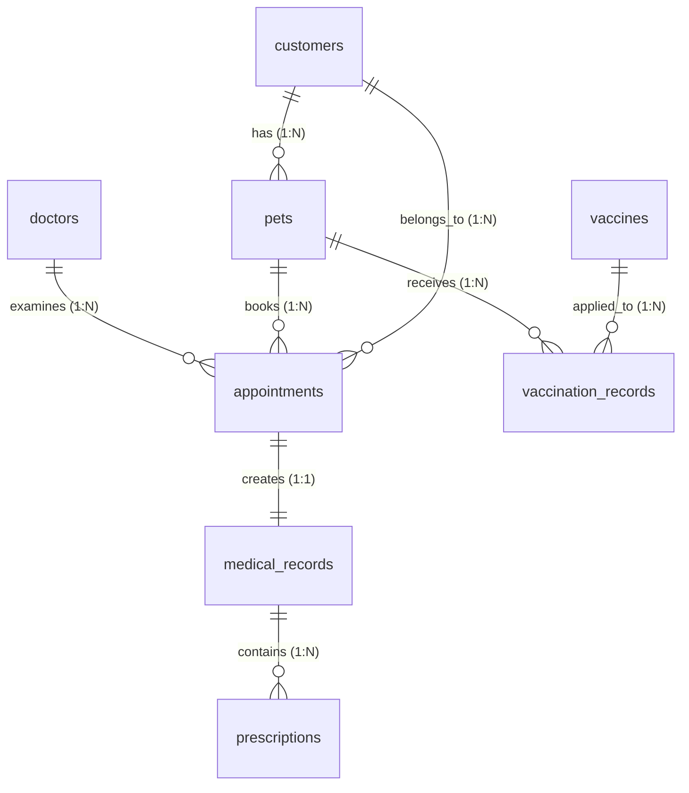

<p align="center">
  <!-- Frontend Badges -->
  
  
  
  
  
  <br />
  <!-- Backend Badges -->
  
  
  
  
  
</p>

<h1 align="center">🐾 PETCARE - HỆ THỐNG QUẢN LÝ PHÒNG KHÁM THÚ Y TOÀN DIỆN</h1>

<p align="center">
  <strong>Hệ thống quản lý quy trình khép kín dành cho: Admin (Quản trị viên), Lễ tân (Receptionist), Bác sĩ (Doctor), và Khách hàng (Customer).</strong><br />
  <i>Dự án phân chia kiến trúc đa cổng thông tin (Multi-portal) đồng bộ qua RESTful API kết nối cơ sở dữ liệu MySQL ổn định, bảo mật cao.</i>
</p>

---

## 📖 Mục lục
1. [Giới thiệu dự án](#1-giới-thiệu-dự-án)
2. [Chi tiết Tính năng theo 4 vai trò người dùng](#2-chi-tiết-tính-năng-theo-4-vai-trò-người-dùng)
3. [Khai báo Chi tiết Công nghệ & Thư viện sử dụng](#3-khai-báo-chi-tiết-công-nghệ--thư-viện-sử-dụng)
4. [Kiến trúc thư mục mã nguồn chi tiết](#4-kiến-trúc-thư-mục-mã-nguồn-chi-tiết)
5. [Cấu trúc Cơ sở dữ liệu (Database Schema & Associations)](#5-cấu-trúc-cơ-sở-dữ-liệu-database-schema--associations)
6. [Tài liệu API Endpoints chi tiết](#6-tài-liệu-api-endpoints-chi-tiết)
7. [Hướng dẫn cài đặt & Khởi chạy hệ thống](#7-hướng-dẫn-cài-đặt--khởi-chạy-hệ-thống)
8. [Thông tin tài khoản kiểm thử liên kết](#8-thông-tin-tài-khoản-kiểm-thử-liên-kết)

---

## 1. Giới thiệu dự án

Dự án **PetCare** ra đời nhằm số hóa toàn bộ hoạt động của phòng khám thú y. Từ các khâu tương tác ngoài trang chủ (Lễ tân cấu hình), đăng ký khám bệnh trực tuyến (Khách hàng thực hiện), tiếp đón & xử lý hóa đơn (Lễ tân thực hiện), khám chữa bệnh & ra đơn thuốc (Bác sĩ thực hiện), đến quản trị hệ thống nhân sự (Quản trị viên quản lý).

Hệ thống được thiết kế theo cấu trúc modular:
- **`PetCare/` (Internal Portal)**: Dành cho Admin, Lễ tân và Bác sĩ. Giao diện được xây dựng tối ưu cho các thao tác nghiệp vụ nội bộ của phòng khám.
- **`PetCareCustomer/` (Customer Portal)**: Dành riêng cho chủ nuôi thú cưng để thuận tiện đặt lịch và tra cứu hồ sơ sức khỏe trên các thiết bị di động và máy tính.
- **`PetCareBackend/` (API Server)**: Trung tâm xử lý nghiệp vụ, kiểm soát xác thực JWT và lưu trữ thông tin tập trung.

---

## 2. Chi tiết Tính năng theo 4 vai trò người dùng

Hệ thống phân quyền người dùng chặt chẽ qua Token JWT và Route Guard, cung cấp các tính năng cụ thể cho từng nhóm vai trò:

### 🛡️ A. Phân hệ Admin (Quản trị viên)
- **Quản lý phân quyền chức vụ**: Phân bổ chức vụ, gán quyền chi tiết cho nhân viên trong hệ thống.
- **Quản lý phân quyền nhân viên**: Quản lý tài khoản đăng nhập của nhân viên nội bộ phòng khám.
- **Quản lý Bác sĩ**: Quản lý thông tin cá nhân bác sĩ, cấu hình lịch trực (lịch làm việc) và theo dõi số ca hẹn của từng bác sĩ.
- **Quản lý chuyên khoa**: Quản lý danh mục chuyên khoa điều trị (ví dụ: Nội khoa, Ngoại khoa, Tiêm phòng, Phẫu thuật).
- **Quản lý phòng khám**: Thêm mới, chỉnh sửa thông tin chi tiết các phòng khám thành viên.
- **Thống kê & Báo cáo**:
  - Thống kê biểu đồ cột số lượng Bác sĩ phân bổ theo phòng khám.
  - Báo cáo số bệnh nhân thú cưng điều trị theo từng Bác sĩ.
  - Biểu đồ thống kê số lượng lịch hẹn phân bổ theo chuyên khoa khám.
  - Biểu đồ theo dõi lịch làm việc chi tiết của nhân viên theo phòng khám.

### 🛎️ B. Phân hệ Lễ tân (Receptionist)
- **Đặt lịch trực tiếp (Offline Booking)**: Hỗ trợ khách hàng đăng ký khám trực tiếp tại quầy nhanh chóng.
- **Quản lý lịch hẹn**: Tiếp nhận thông tin khám bệnh, phân công phòng khám và Bác sĩ khám cho thú cưng.
- **Thanh toán & Hóa đơn**: Tạo hóa đơn dịch vụ, hóa đơn thuốc, kiểm tra trạng thái thanh toán (`Chưa thanh toán`, `Đã thanh toán`).
- **Quản trị thông tin Landing Page**:
  * Cấu hình bài viết giới thiệu phòng khám.
  * Quản lý kho ảnh thực tế (gallery) của clinic.
  * Đăng tải bài viết tin tức y học thú cưng, cẩm nang chăm sóc.
  * Quản lý thông tin liên hệ và xử lý phản hồi từ khách hàng.

### 🩺 C. Phân hệ Bác sĩ (Doctor Portal)
- **Lịch cá nhân**: Xem lịch trực cá nhân chi tiết theo tuần/tháng.
- **Danh sách ca khám**: Tiếp đón các ca bệnh được lễ tân chuyển vào, tiến hành cập nhật trạng thái (`waiting`, `in_progress`, `completed`).
- **Hồ sơ bệnh án điện tử**:
  - Đo lường và lưu trữ chỉ số vital (cân nặng, nhiệt độ cơ thể).
  - Khai báo các triệu chứng lâm sàng của thú cưng.
  - Chẩn đoán bệnh và kê đơn thuốc (Tên thuốc, hàm lượng, cách dùng, số ngày sử dụng).
- **Quản lý tiêm chủng**: Lên lịch hẹn tiêm phòng các mũi tiếp theo dựa trên khoảng cách ngày quy định của vaccine.

### 👤 D. Phân hệ Khách hàng (Customer Portal)
- **Quản lý hồ sơ thú cưng**: Khai báo thông tin chi tiết các bé cưng (tên, loài, giống, giới tính, cân nặng, mã microchip nếu có).
- **Đặt lịch khám online 3 bước**:
  - *Bước 1*: Chọn thú cưng điều trị & Dịch vụ khám.
  - *Bước 2*: Chọn ngày khám khả dụng & khung giờ rảnh.
  - *Bước 3*: Chọn bác sĩ yêu thích & mô tả chi tiết triệu chứng lâm sàng.
- **Theo dõi lịch hẹn**: Theo dõi tiến độ lịch hẹn khám trực quan, hỗ trợ dời lịch hoặc hủy lịch online.
- **Sổ khám bệnh online**: Xem lại kết quả chẩn đoán của bác sĩ, đơn thuốc, lịch tiêm phòng vaccine và nhận thông báo cảnh báo mũi tiêm sắp đến hạn/quá hạn.

---

## 3. Khai báo Chi tiết Công nghệ & Thư viện sử dụng

### 🖥️ Frontend (Port 5173 - Doctor/Admin/Receptionist & Port 5174 - Customer)
Hệ thống Frontend được viết bằng **Vue 3** kết hợp **TypeScript** chạy trên nền **Vite** mang lại tốc độ biên dịch cực nhanh. Các gói thư viện phụ trợ chính bao gồm:
* **`pinia`**: Quản lý trạng thái đăng nhập, bộ nhớ đệm thông tin người dùng và dữ liệu đồng bộ.
* **`vue-router`**: Định tuyến trang web, tích hợp Route Guards kiểm tra Token trong LocalStorage (`checkAdmin`, `checkBacSi`, `checkLeTan`).
* **`chart.js`**: Sử dụng vẽ các biểu đồ KPI (số lượng lịch hẹn, doanh thu) trực quan ở Dashboard.
* **`Simplebar` & `Perfect Scrollbar`**: Tối ưu hóa trải nghiệm cuộn thanh menu mượt mà trên mọi trình duyệt.
* **`Metismenu`**: Tạo danh sách menu phân cấp gọn gàng và khoa học.
* **`Smart Wizard`**: Sử dụng cho luồng đặt lịch khám nhiều bước (Multi-step booking form).
* **`Lobibox Notifications`**: Hiển thị popup thông báo (Toast Alert) sinh động khi đăng nhập thành công hoặc lỗi.

### ⚙️ Backend (Port 3000 - API Server)
Backend được xây dựng bằng **Node.js** và **Express.js**, kết nối hệ quản trị CSDL quan hệ **MySQL** thông qua **Sequelize ORM** giúp loại bỏ việc viết lệnh SQL thuần, tối ưu hóa hiệu năng truy vấn. Các thư viện phụ trợ chính bao gồm:
* **`sequelize` & `mysql2`**: Quản lý ánh xạ thực thể cơ sở dữ liệu (ORM) và kết nối Connection Pool.
* **`jsonwebtoken`**: Tạo mã token xác thực (JWT) gồm Access Token (1 ngày) và Refresh Token (7 ngày).
* **`bcryptjs`**: Mã hóa một chiều mật khẩu người dùng bằng giải thuật băm Salted Bcrypt, đảm bảo an toàn thông tin tối đa.
* **`multer`**: Middleware xử lý upload hình ảnh của thú cưng và lưu trữ vào đĩa cứng nội bộ.
* **`cors`**: Cấu hình chia sẻ tài nguyên nguồn gốc chéo (CORS) cho phép Port 5173 và Port 5174 truy cập API an toàn.
* **`dotenv`**: Nạp các biến môi trường cấu hình cổng, thông tin database từ file `.env`.

---

## 4. Kiến trúc thư mục mã nguồn chi tiết

Kiến trúc thư mục của 3 dự án thành phần được phân bổ chi tiết như sau:

```
DOANTHUAN/
├── PetCare/                           # 🩺 PORTAL BÁC SĨ, LỄ TÂN & ADMIN
│   ├── src/
│   │   ├── assets/                    # CSS giao diện Rocker Theme, Fonts, Plugins
│   │   ├── components/                # Thư mục chứa các Component Vue chính
│   │   │   ├── Admin/                 # Phân quyền chức vụ/nhân viên, quản lý bác sĩ, phòng khám, thống kê
│   │   │   ├── Bacsi/                 # Kích hoạt tài khoản, lịch trực, lịch hẹn khám, quản lý bệnh nhân, profile
│   │   │   └── Letan/                 # Đặt khám trực tiếp, thanh toán, quản lý tin tức, liên hệ, homepage
│   │   ├── core/                      # Trình gửi HTTP request (baseRequestAdmin, baseRequestBacsi, baseRequestLeTan)
│   │   ├── layout/                    # Layout khung sườn (Sidebar, AppHeader, BotRocker) cho từng vai trò
│   │   ├── router/                    # Kiểm tra Route Guard phân quyền nhân viên đăng nhập
│   │   ├── stores/                    # Pinia stores (auth, appointments, medicalRecords, vaccinations)
│   │   ├── types/                     # Kiểu dữ liệu TypeScript (Doctor, Appointment, Vaccine...)
│   │   └── views/                     # DashboardView, AppointmentView, MedicalRecordView, VaccinationView
│   ├── package.json
│   └── vite.config.ts
│
├── PetCareCustomer/                   # 👤 PORTAL KHÁCH HÀNG
│   ├── src/
│   │   ├── components/                # CustomerHeader, CustomerSidebar
│   │   ├── services/api.ts            # Fetch API helper với cơ chế tự động gửi JWT Token khách hàng
│   │   ├── stores/                    # Pinia stores (customerAuth, pets, bookings, healthRecords, vaccineBook)
│   │   ├── types/                     # Kiểu dữ liệu khách hàng, thú cưng, hóa đơn, thông báo
│   │   └── views/                     # CustomerDashboardView, MyPetsView, BookingView, HealthRecordsView...
│   └── package.json
│
└── PetCareBackend/                    # ⚙️ SERVER BACKEND API
    ├── server.js                      # Điểm chạy máy chủ Express chính
    ├── src/
    │   ├── config/                    # Cấu hình Database Sequelize và JWT Secret Key
    │   ├── middleware/                # JWT Auth Guard, Upload ảnh Multer, Global Error Handler
    │   ├── models/                    # Định nghĩa cấu trúc 8 bảng dữ liệu quan hệ trong Sequelize ORM
    │   │   ├── index.js               # Khai báo các khóa ngoại và liên kết thực thể (Associations)
    │   │   ├── Doctor.js              # Model Bác sĩ
    │   │   ├── Customer.js            # Model Khách hàng
    │   │   ├── Pet.js                 # Model Thú cưng
    │   │   ├── Appointment.js         # Model Lịch hẹn khám
    │   │   ├── MedicalRecord.js       # Model Bệnh án chi tiết
    │   │   ├── Prescription.js        # Model Đơn thuốc
    │   │   ├── Vaccine.js             # Model Vaccine
    │   │   └── VaccinationRecord.js   # Model Sổ tiêm phòng vaccine
    │   ├── controllers/               # Xử lý logic nghiệp vụ nghiệp vụ API
    │   ├── routes/                    # Quản lý các tuyến đường dẫn API
    │   └── seeders/seed.js            # Tập tin tự động sinh dữ liệu mẫu liên kết
    └── package.json
```

---

## 5. Cấu trúc Cơ sở dữ liệu (Database Schema & Associations)

Hệ thống được thiết kế theo cấu trúc cơ sở dữ liệu quan hệ chặt chẽ. Sequelize ORM quản lý mối liên kết giữa các bảng bằng khóa ngoại (Foreign Keys):



### Chi tiết các quan hệ chính (Associations in `src/models/index.js`):
* **Khách hàng & Thú cưng**: `Customer.hasMany(Pet)` & `Pet.belongsTo(Customer)` qua `customer_id`.
* **Thú cưng & Lịch hẹn**: `Pet.hasMany(Appointment)` & `Appointment.belongsTo(Pet)` qua `pet_id`.
* **Lịch hẹn & Bác sĩ**: `Doctor.hasMany(Appointment)` & `Appointment.belongsTo(Doctor)` qua `doctor_id`.
* **Lịch hẹn & Bệnh án**: `Appointment.hasOne(MedicalRecord)` & `MedicalRecord.belongsTo(Appointment)` qua `appointment_id`.
* **Bệnh án & Đơn thuốc**: `MedicalRecord.hasMany(Prescription)` & `Prescription.belongsTo(MedicalRecord)` qua `medical_record_id`.
* **Thú cưng & Sổ tiêm phòng**: `Pet.hasMany(VaccinationRecord)` & `VaccinationRecord.belongsTo(Pet)` qua `pet_id`.
* **Vaccine & Sổ tiêm phòng**: `Vaccine.hasMany(VaccinationRecord)` & `VaccinationRecord.belongsTo(Vaccine)` qua `vaccine_id`.

---

## 6. Tài liệu API Endpoints chi tiết

Toàn bộ các API HTTP Request đều trả về kiểu định dạng JSON chuẩn hóa: `{ success: boolean, data?: any, message?: string }`.

### 🔓 A. APIs Xác thực & Tài khoản (Auth & Accounts)
| Phương thức | Đường dẫn API | Chức năng | Quyền truy cập |
|---|---|---|---|
| `POST` | `/api/auth/doctor/login` | Đăng nhập tài khoản Bác sĩ | Công khai |
| `POST` | `/api/auth/customer/login` | Đăng nhập tài khoản Khách hàng | Công khai |
| `POST` | `/api/auth/customer/register` | Đăng ký tài khoản Khách hàng mới | Công khai |
| `POST` | `/api/auth/refresh-token` | Làm mới Access Token bằng Refresh Token | Công khai |

### 🩺 B. APIs phân hệ Bác sĩ (Doctor & Dashboard APIs)
| Phương thức | Đường dẫn API | Chức năng | Quyền truy cập |
|---|---|---|---|
| `GET` | `/api/doctors` | Lấy danh sách toàn bộ Bác sĩ thú y | Công khai |
| `GET` | `/api/doctors/me` | Lấy thông tin cá nhân Bác sĩ đang đăng nhập | Bác sĩ |
| `PUT` | `/api/doctors/me` | Cập nhật thông tin cá nhân Bác sĩ | Bác sĩ |
| `GET` | `/api/doctors/dashboard-stats` | Lấy số liệu thống kê ca bệnh vẽ biểu đồ | Bác sĩ |

### 📅 C. APIs Lịch hẹn khám (Appointments APIs)
| Phương thức | Đường dẫn API | Chức năng | Quyền truy cập |
|---|---|---|---|
| `GET` | `/api/appointments` | Lấy danh sách lịch hẹn (lọc theo ngày, trạng thái) | Bác sĩ / Khách hàng |
| `GET` | `/api/appointments/today` | Lấy danh sách các ca hẹn khám trong ngày hôm nay | Bác sĩ |
| `POST` | `/api/appointments` | Tạo mới một lịch hẹn khám thú cưng | Khách hàng |
| `PUT` | `/api/appointments/:id` | Cập nhật thông tin lịch hẹn (ngày, giờ, ghi chú) | Bác sĩ / Khách hàng |
| `PATCH` | `/api/appointments/:id/status` | Cập nhật nhanh trạng thái cuộc hẹn | Bác sĩ |
| `DELETE` | `/api/appointments/:id` | Hủy bỏ lịch hẹn khám | Khách hàng |

### 📋 D. APIs Bệnh án, Đơn thuốc & Vaccine
| Phương thức | Đường dẫn API | Chức năng | Quyền truy cập |
|---|---|---|---|
| `GET` | `/api/medical-records` | Lấy danh sách bệnh án thú cưng | Bác sĩ / Khách hàng |
| `POST` | `/api/medical-records` | Lưu thông tin bệnh án và tự động tạo đơn thuốc | Bác sĩ |
| `GET` | `/api/medical-records/pet/:petId` | Lấy lịch sử bệnh án của riêng một thú cưng | Bác sĩ / Khách hàng |
| `GET` | `/api/vaccines` | Lấy danh mục các loại vaccine của phòng khám | Công khai |
| `GET` | `/api/vaccinations` | Lấy sổ tiêm phòng vaccine | Bác sĩ / Khách hàng |
| `GET` | `/api/vaccinations/upcoming` | Lấy danh sách vaccine sắp đến hạn tiêm | Bác sĩ / Khách hàng |

---

## 7. Hướng dẫn cài đặt & Khởi chạy hệ thống

Để khởi chạy toàn bộ hệ thống PetCare trên máy cục bộ của bạn, hãy lần lượt thực hiện theo các bước sau:

### Bước 1: Chuẩn bị Cơ sở dữ liệu MySQL
1. Đảm bảo rằng máy chủ MySQL của bạn đã được bật (mặc định chạy cổng 3306).
2. Tạo cơ sở dữ liệu mới thông qua CLI hoặc công cụ quản trị dữ liệu:
   ```sql
   CREATE DATABASE petcare_db CHARACTER SET utf8mb4 COLLATE utf8mb4_unicode_ci;
   ```

### Bước 2: Khởi động máy chủ Backend API (PetCareBackend)
1. Di chuyển vào thư mục backend:
   ```bash
   cd PetCareBackend
   ```
2. Tạo file cấu hình môi trường `.env` dựa theo file [.env.example](file:///Users/nguyenvanvang/Documents/DOANTHUAN/PetCareBackend/.env.example) và điều chỉnh thông tin kết nối MySQL của bạn:
   ```env
   PORT=3000
   DB_HOST=localhost
   DB_PORT=3306
   DB_NAME=petcare_db
   DB_USER=root
   DB_PASSWORD=your_mysql_password
   ```
3. Cài đặt thư viện dependencies của backend:
   ```bash
   npm install
   ```
4. Chạy tệp Seed để khởi tạo tự động các bảng cơ sở dữ liệu và nạp dữ liệu mẫu:
   ```bash
   npm run seed
   ```
5. Khởi động server API ở chế độ phát triển (chạy hot-reload tự động tải lại khi sửa file):
   ```bash
   npm run dev       # API sẽ khởi chạy tại cổng http://localhost:3000
   ```

### Bước 3: Khởi chạy Cổng thông tin Nội bộ Bác sĩ, Lễ tân & Admin (PetCare)
1. Mở một Terminal mới và di chuyển vào thư mục dự án:
   ```bash
   cd PetCare
   ```
2. Cài đặt các thư viện Frontend:
   ```bash
   npm install
   ```
3. Khởi chạy dự án ở môi trường phát triển:
   ```bash
   npm run dev       # Ứng dụng chạy tại cổng http://localhost:5173
   ```

### Bước 4: Khởi chạy Cổng thông tin Khách hàng (PetCareCustomer)
1. Mở tiếp một Terminal mới và di chuyển vào thư mục dự án:
   ```bash
   cd PetCareCustomer
   ```
2. Cài đặt các thư viện Frontend:
   ```bash
   npm install
   ```
3. Khởi chạy dự án khách hàng:
   ```bash
   npm run dev       # Ứng dụng chạy tại cổng http://localhost:5174
   ```

---

## 8. Thông tin tài khoản kiểm thử liên kết

Sau khi chạy lệnh `npm run seed` ở Bước 2, cơ sở dữ liệu MySQL sẽ được tự động điền sẵn các tài khoản mẫu sau để bạn kiểm thử luồng nghiệp vụ liên thông giữa 4 vai trò:

### 🩺 Bác sĩ thú y (Đăng nhập tại cổng Bác sĩ - Port 5173)
| Tên Bác sĩ | Email Đăng nhập | Mật khẩu truy cập | Chuyên khoa |
|---|---|---|---|
| BS. Nguyễn Minh Khoa | `dr.khoa@petcare.vn` | `123456` | Nội khoa thú y |
| BS. Trần Thị Mai | `dr.mai@petcare.vn` | `123456` | Ngoại khoa & Phẫu thuật |
| BS. Lê Văn Hùng | `dr.hung@petcare.vn` | `123456` | Tiêm chủng & Vaccine |

### 👤 Khách hàng nuôi thú cưng (Đăng nhập tại cổng Khách hàng - Port 5174)
| Tên Khách hàng | Email Đăng nhập | Mật khẩu truy cập | Thú cưng liên kết (Đã có sẵn dữ liệu khám) |
|---|---|---|---|
| Nguyễn Thị Lan | `lan.nguyen@gmail.com` | `123456` | Mochi (Chó Shiba Inu), Luna (Mèo Anh lông ngắn) |
| Trần Minh Hoàng | `mai@gmail.com` | `123456` | Biscuit (Thỏ Holland Lop) |
| Lê Văn Hùng | `hung@gmail.com` | `123456` | Cún con |
