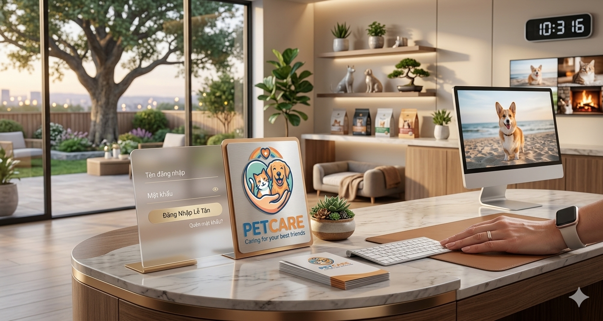
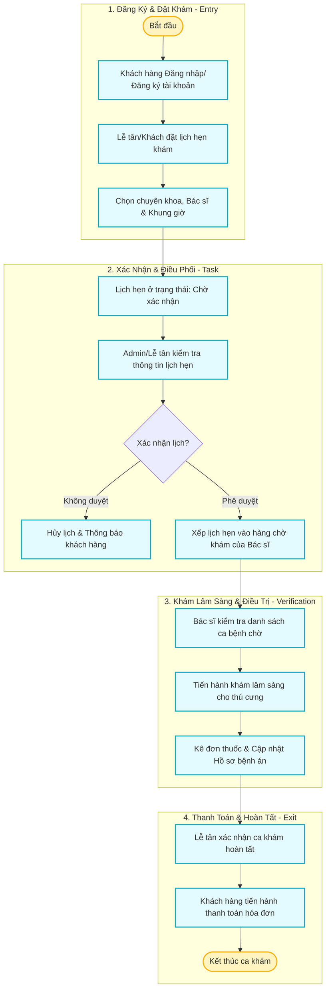

# 🐾 Hệ Thống Quản Lý Phòng Khám Thú Y — PetCare

<div align="center">
  
  <p><em>Hệ thống quản lý thông minh, toàn diện dành cho phòng khám thú y hiện đại</em></p>

  [](https://sonarcloud.io/summary/new_code?id=trananhtai2204205-beep_PetCare)
  [](https://sonarcloud.io/summary/new_code?id=trananhtai2204205-beep_PetCare)
  [](https://sonarcloud.io/summary/new_code?id=trananhtai2204205-beep_PetCare)
  [](https://sonarcloud.io/summary/new_code?id=trananhtai2204205-beep_PetCare)
  [](https://sonarcloud.io/summary/new_code?id=trananhtai2204205-beep_PetCare)
</div>

---

## 📝 1. Giới Thiệu Dự Án (Introduction)

**PetCare** là một nền tảng Web-Application hiện đại được thiết kế chuyên biệt để tối ưu hóa quy trình vận hành và quản lý của các phòng khám thú y. Với mục tiêu số hóa toàn bộ khâu tiếp nhận và chăm sóc sức khỏe thú cưng, hệ thống hỗ trợ kết nối đồng bộ và phân quyền chặt chẽ giữa 3 đối tượng chính:

*   **🧑‍💼 Quản trị viên (Admin)**: Kiểm soát toàn bộ hệ thống, quản lý thông tin nhân sự (bác sĩ, lễ tân), chuyên khoa, phòng khám, quản lý quyền hạn (RBAC) và theo dõi biểu đồ doanh thu, thống kê số lượng ca khám qua bảng điều khiển thông minh.
*   **🧑‍💻 Lễ tân (Khách hàng)**: Tiếp nhận thú cưng trực tiếp tại quầy, hỗ trợ khách hàng đăng ký thông tin trực tuyến, đặt lịch hẹn khám theo bác sĩ và khung giờ trống, xuất hóa đơn và xử lý thanh toán nhanh chóng.
*   **👨‍⚕️ Bác sĩ thú y (Veterinarians)**: Theo dõi danh sách ca bệnh phân công theo thời gian thực, quản lý bệnh án lâm sàng chi tiết của thú cưng, kê đơn thuốc điện tử và theo dõi lịch làm việc cá nhân.

Hệ thống được phát triển theo mô hình tách biệt hoàn toàn **Client-Server (Restful API)** giúp tối ưu hiệu năng tải trang, nâng cao khả năng mở rộng và tăng cường tính bảo mật dữ liệu.

---

## 🛠️ 2. Chi Tiết Công Nghệ Sử Dụng (Detailed Tech Stack)

Dự án ứng dụng các công nghệ tiên tiến nhất trong phát triển Web hiện nay, đảm bảo các tiêu chuẩn về hiệu năng, bảo mật và khả năng bảo trì lâu dài.

### 2.1 Frontend (Client Application)
Được xây dựng trên nền tảng Single Page Application (SPA) hiện đại:
*   **Vue 3 (Composition API / Options API)**: Framework chính để xây dựng giao diện người dùng reactive, linh hoạt và tái sử dụng linh kiện (components) hiệu quả.
*   **Vite**: Công cụ build frontend thế hệ mới thay thế Webpack, cung cấp tính năng Hot Module Replacement (HMR) cực nhanh trong quá trình phát triển.
*   **TypeScript (TS)**: Đảm bảo kiểm soát kiểu dữ liệu tĩnh nghiêm ngặt, giảm thiểu lỗi runtime trong quá trình code và tối ưu hóa IDE support.
*   **Vue Router 4**: Quản lý định tuyến trang, bảo vệ các tuyến đường riêng tư bằng cơ chế Route Guards (xác thực token).
*   **Axios**: Thư viện HTTP client để giao tiếp và gửi/nhận dữ liệu bất đồng bộ (async/await) với Laravel RESTful API.
*   **Chart.js & Vue-ChartJS**: Vẽ các biểu đồ cột, biểu đồ đường trực quan phục vụ tính năng thống kê doanh thu và ca bệnh của Admin.
*   **Vue Easy Lightbox**: Thư viện hỗ trợ hiển thị xem ảnh hồ sơ bệnh án và thú cưng dưới dạng popup mượt mà.
*   **Bootstrap 5 & JQuery**: Cung cấp grid-system giúp giao diện hiển thị tốt trên mọi kích thước màn hình (Responsive Design) và các hiệu ứng động của template Rocker.

### 2.2 Backend (RESTful API Server)
Kiến trúc API mạnh mẽ, bảo mật và chuẩn hóa:
*   **Laravel 12 (PHP 8.4)**: Framework MVC phổ biến nhất của PHP, chịu trách nhiệm xử lý logic nghiệp vụ, quản lý cơ sở dữ liệu và cung cấp RESTful API.
*   **MySQL**: Hệ quản trị cơ sở dữ liệu quan hệ (RDBMS) dùng để lưu trữ an toàn các thông tin người dùng, lịch hẹn, bệnh án và các phân quyền.
*   **Laravel Sanctum**: Giải pháp xác thực dựa trên Token gọn nhẹ nhưng vô cùng bảo mật, cấp và thu hồi token của người dùng khi đăng nhập/đăng xuất.
*   **Eloquent ORM**: Giúp tương tác với database thông qua các đối tượng hướng đối tượng (OOP) thay vì viết mã SQL thủ công, tăng tốc độ truy vấn.
*   **Database Migrations & Seeders**: Quản lý lịch sử thay đổi cấu trúc database và tự động nạp dữ liệu thử nghiệm chuẩn hóa khi deploy.

### 2.3 CI/CD & Chất lượng mã nguồn (DevOps)
*   **GitHub Actions**: Tự động thực thi quy trình cài đặt thư viện và kiểm tra build ngay khi có thay đổi code.
*   **SonarCloud**: Quét tĩnh mã nguồn (Static Code Analysis) để tìm kiếm lỗ hổng bảo mật, lỗi logic và đo lường độ trùng lặp mã nguồn (Clean Code).

---

## 📌 3. Sơ Đồ Quy Trình Nghiệp Vụ Tích Hợp (ETVX / SDLC Workflow)

Dưới đây là sơ đồ quy trình hoạt động nghiệp vụ tích hợp (ETVX: Entry - Task - Verification - Exit) của hệ thống PetCare:



---

## 📖 4. Tài Liệu API Chi Tiết (Detailed API Reference)

> [!NOTE]  
> Hệ thống API Backend sử dụng xác thực qua **Laravel Sanctum**. Mọi request gửi đi yêu cầu đính kèm Header: `Authorization: Bearer <TOKEN>`.

### ➡️ Phân hệ Lễ tân (Khách hàng)

* **Đăng nhập hệ thống**
  * `POST` `/api/le-tan/login`
  * **Request Body (JSON)**:
    ```json
    {
      "email": "letan@gmail.com",
      "password": "password123"
    }
    ```
  * **Response (Success - 200)**:
    ```json
    {
      "status": true,
      "message": "Đăng nhập thành công!",
      "token": "1|abcdef123456...",
      "ho_ten": "Lễ Tân A"
    }
    ```

* **Đặt lịch khám thú cưng**
  * `POST` `/api/le-tan/dat-lich`
  * **Request Body (JSON)**:
    ```json
    {
      "id_bac_si": 3,
      "id_chuyen_khoa": 1,
      "ngay_dat": "2026-07-20",
      "khung_gio": "09:00 - 10:00",
      "ten_thu_cung": "Miu Miu",
      "trieu_chung": "Mệt mỏi, bỏ ăn"
    }
    ```

### ➡️ Phân hệ Bác sĩ

* **Xem danh sách lịch hẹn được phân công**
  * `GET` `/api/bac-si/lich-hen`
  * **Response (Success - 200)**:
    ```json
    {
      "status": true,
      "data": [
        {
          "id": 1,
          "ten_thu_cung": "Miu Miu",
          "ngay_dat": "2026-07-20",
          "khung_gio": "09:00 - 10:00",
          "trieu_chung": "Mệt mỏi, bỏ ăn",
          "trang_thai": "Đã duyệt"
        }
      ]
    }
    ```

* **Cập nhật hồ sơ bệnh án & kê đơn**
  * `POST` `/api/bac-si/quan-ly-pet-care/store`
  * **Request Body (JSON)**:
    ```json
    {
      "id_lich_hen": 1,
      "chuan_doan": "Cảm cúm thông thường ở mèo",
      "don_thuoc": "Paracetamol 500mg, Vitamin C",
      "ghi_chu": "Cho uống nước ấm, tái khám sau 3 ngày"
    }
    ```

---

## 🗂️ 5. Cấu Trúc Thư Mục Dự Án

| Thư mục | Vai trò | Công nghệ chính |
| :--- | :--- | :--- |
| `📂 PetCare/` | Frontend Client & Admin | Vue 3, Vite, Axios, Bootstrap |
| `📂 Be-PetCare--feature-develop/` | Backend RESTful API | Laravel 12, MySQL, Sanctum |

---

## 🖥️ 6. Hướng Dẫn Cài Đặt Nhanh (Quick Start)

### 6.1 Cấu hình Backend (Laravel)

```bash
# 1. Di chuyển vào thư mục Backend
cd Be-PetCare--feature-develop

# 2. Cài đặt các thư viện PHP
composer install

# 3. Tạo file cấu hình môi trường
cp .env.example .env

# 4. Tạo mã khóa ứng dụng
php artisan key:generate
```

> [!IMPORTANT]  
> Tạo cơ sở dữ liệu mới trong MySQL với tên `PetCare`. Sau đó cập nhật cấu hình kết nối trong file `.env`:
> ```env
> DB_DATABASE=PetCare
> DB_USERNAME=root
> DB_PASSWORD=
> ```

```bash
# 5. Khởi tạo bảng dữ liệu và nạp dữ liệu mẫu
php artisan migrate --seed

# 6. Tạo liên kết thư mục storage
php artisan storage:link

# 7. Khởi chạy Server Backend
php artisan serve
```
👉 Server API chạy tại: **[http://127.0.0.1:8000](http://127.0.0.1:8000)**

### 6.2 Cấu hình Frontend (Vue 3)

```bash
# 1. Di chuyển vào thư mục Frontend
cd PetCare

# 2. Cài đặt các thư viện Node.js
npm install

# 3. Khởi chạy môi trường Local
npm run dev
```
👉 Giao diện ứng dụng chạy tại: **[http://localhost:5173](http://localhost:5173)**

---

## 🔑 7. Tài Khoản Đăng Nhập Thử Nghiệm

Dưới đây là danh sách tài khoản được tạo tự động sau khi chạy lệnh nạp dữ liệu (seed):

| Vai trò | Đường dẫn đăng nhập | Email mẫu | Mật khẩu mặc định |
| :--- | :--- | :--- | :--- |
| **🧑‍💼 Quản trị viên (Admin)** | `/admin/login` | `admin@gmail.com` | `123456` |
| **🧑‍💻 Nhân viên Lễ tân** | `/login` | `letan@gmail.com` | `123456` |
| **👨‍⚕️ Bác sĩ thú y** | `/bac-si/login` | `bacsi@gmail.com` | `123456` |

---

## 🛠️ 8. Khắc Phục Lỗi Thường Gặp (Troubleshooting)

> [!TIP]  
> **Lỗi CORS (Cross-Origin Resource Sharing)**  
> Mở file `config/cors.php` trong Laravel Backend và cập nhật để cho phép kết nối từ Frontend:
> ```php
> 'allowed_origins' => ['http://localhost:5173'],
> ```

> [!WARNING]  
> **Lỗi Xác Thực 401 Unauthorized**  
> Nếu gặp lỗi 401 khi gọi API sau một khoảng thời gian không thao tác, hãy đăng xuất tài khoản và đăng nhập lại để làm mới mã Token trong LocalStorage.

---
*📅 Tài liệu được cập nhật và tối ưu thẩm mỹ ngày: 16/07/2026 bởi Antigravity*
